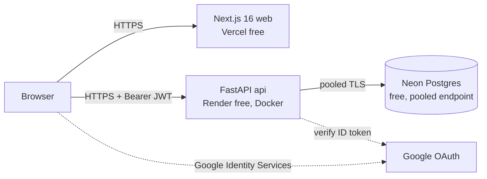
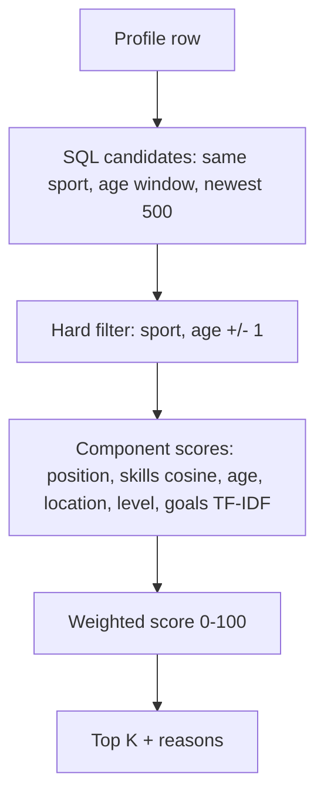
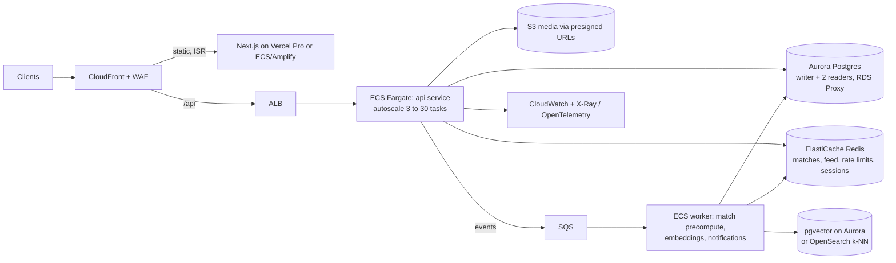

# Ground Up: System Architecture

Two stages. **Stage 1** runs on free tiers for development and demo. **Stage 2** moves to AWS to serve ~1M users. Stage 1 is built so that Stage 2 is a *lift*, not a rewrite: stateless API in a Docker image, Postgres as the only state, all config via env vars.

## 1. Stage 1 (now): free tier



| Component | Tech | Host (free) | Notes |
|---|---|---|---|
| Web | Next.js 16 App Router, Turbopack, Tailwind v4, Phosphor icons | Vercel Hobby (or Render static) | `proxy.ts` gates routes on the `gu_token` cookie (optimistic only) |
| API | FastAPI, SQLAlchemy 2, Alembic, scikit-learn | Render free web service (`render.yaml`, Docker) | Sleeps after 15 min idle, ~50 s cold start, 512 MB RAM |
| DB | Postgres 17 | Neon free (0.5 GB, autosuspend) | Use the **pooled** (`-pooler`) URL with `sslmode=require` |
| Auth | Google ID token, verified server-side, API issues HS256 JWT (7 days) | n/a | Dev-only `/auth/dev` disabled when `ENV=production` |
| Local dev | `docker compose up` (Postgres :5433, API :8001), `npm run dev` (:3000) | n/a | Docker because Windows Smart App Control blocks psycopg/sklearn DLLs |

### Data model
```mermaid
erDiagram
  users ||--o| profiles : has
  users ||--o{ posts : writes
  users ||--o{ opportunities : posts
  users { uuid id PK; text email UK; text phone UK; text role; text mode; text verification_doc; text verification_status }
  profiles { uuid user_id PK,FK; text sport; text position; int age; text city; text region; text level; text_array skills; text goals; text bio }
  opportunities { uuid id PK; uuid posted_by FK; text title; text org; text type; text sport; text_array positions; int age_min; int age_max; text city; text region; text level; text_array skills; text description; bool synthetic }
  posts { uuid id PK; uuid author_id FK; text body; timestamptz created_at }
```
- UUID keys everywhere: no hot sequence, safe for sharding or merging later.
- Indexes: `opportunities(sport, created_at)`, `profiles(sport)`, `posts(created_at)`.
- ID documents: only type + status are stored. **Never ID numbers.**

### API surface
| Method | Path | Auth | Purpose |
|---|---|---|---|
| GET | `/health` | none | liveness |
| POST | `/auth/google` | none | Google ID token to JWT |
| POST | `/auth/dev` | none, dev only | email to JWT |
| GET | `/me` | JWT | current user + profile |
| PUT | `/me/profile` | JWT | upsert profile (feeds matcher) |
| POST | `/me/verification` | JWT | request ID check, status becomes `pending` |
| GET | `/opportunities` | none | latest, filter by sport |
| GET | `/opportunities/recommended?k=` | JWT | ranked matches with score, components, reasons |
| GET/POST | `/posts` | GET none / POST JWT | feed, keyset pagination via `before` |
| GET | `/people/suggested` | JWT | same sport, skill + city similarity |

### Recommendation flow (per request in Stage 1)

Code: `api/app/matching.py` (pure functions, unit tested in `api/tests/test_matching.py`).

### Known Stage 1 ceilings (marked `ponytail:` in code)
| Shortcut | Ceiling | Upgrade |
|---|---|---|
| Score 500 candidates per request in Python | ~50 RPS per instance | Precompute matches in a worker, cache in Redis |
| TF-IDF for goals | misses synonyms | Sentence-BERT embeddings (needs more than 512 MB RAM) |
| JS-readable cookie + Bearer header | XSS can read token | Same-site `api.` subdomain + httpOnly cookie |
| Migrations on container boot | races with N replicas | One-off migration task in CI/CD |
| Verification records intent only | no real check | KYC provider (DigiLocker, etc.) via webhook |
| `/opportunities` posting only via seed | orgs can't post yet | Org role + CRUD + moderation |

## 2. Stage 2 (scale): AWS, ~1M users

Target load (assumption): 1M registered, ~50k DAU, ~2k RPS peak, feed-heavy reads (~90% reads).



### What changes and why
| Concern | Stage 2 design |
|---|---|
| Compute | Same Docker image on ECS Fargate behind ALB. Stateless, horizontal autoscale on CPU and p95 latency. |
| DB | Aurora Postgres. Writes to writer, feed and lists to readers. **RDS Proxy** pools connections across many tasks. PITR, multi-AZ. |
| Recommendations | On profile change or new opportunity, publish to SQS. Worker recomputes affected athletes' top-K and stores in Redis (`match:{user}`) and a `matches` table. API reads cache, so O(1) per request. |
| Candidate retrieval | Embed profiles and opportunities (Sentence-BERT) into **pgvector** (HNSW). ANN retrieves top ~500, then the same `matching.rank` re-scores and explains. Scales to millions of opportunities. |
| Feed | Fan-out-on-read with keyset pagination plus Redis cache for hot timelines. Move to fan-out-on-write for followed accounts once a follow graph exists. |
| Media | S3 presigned uploads from browser, CloudFront delivery, Lambda thumbnails. |
| Auth | Keep Google + add phone OTP (SNS or a provider). httpOnly cookie on same-site API domain. JWT signing key in KMS / Secrets Manager, rotation. |
| Verification | KYC provider integration, webhooks to update `verification_status`, audit log. |
| Rate limiting / abuse | WAF managed rules + Redis token bucket per user/IP. |
| Observability | Structured JSON logs, OpenTelemetry traces, CloudWatch alarms on p95, 5xx, DB CPU, queue depth. |
| Delivery | GitHub Actions: test, build image, push ECR, run Alembic as one-off ECS task, blue/green deploy. IaC with Terraform or CDK. |
| Compliance | India DPDP Act: consent, data export/delete endpoints, data residency in ap-south-1 (Mumbai). |

### Migration path (Stage 1 to Stage 2)
1. Create Aurora in `ap-south-1`. `pg_dump` from Neon, restore (or logical replication for zero downtime).
2. Push the same API image to ECR. Run on ECS with the new `DATABASE_URL` through RDS Proxy.
3. Point `api.groundup.*` DNS at the ALB. Move the token to an httpOnly cookie on the shared parent domain.
4. Add Redis + SQS worker. Switch `/opportunities/recommended` to read precomputed matches with live fallback.
5. Add pgvector + embeddings in the worker. Swap SQL candidate query for ANN.
6. Decommission Render/Neon.

### Capacity notes (rough)
- 2k RPS with ~70% cache hits leaves ~600 RPS on Postgres readers: comfortable for 2 Aurora readers (r6g.large).
- Matches precomputed: 1M athletes x 20 matches x ~100 B is about 2 GB in Redis. Fits a single r6g.large node; cluster mode when it grows.
- Posts: 50k DAU x 2 posts/day is about 36M rows/year. Partition `posts` by month when it passes ~100M.
